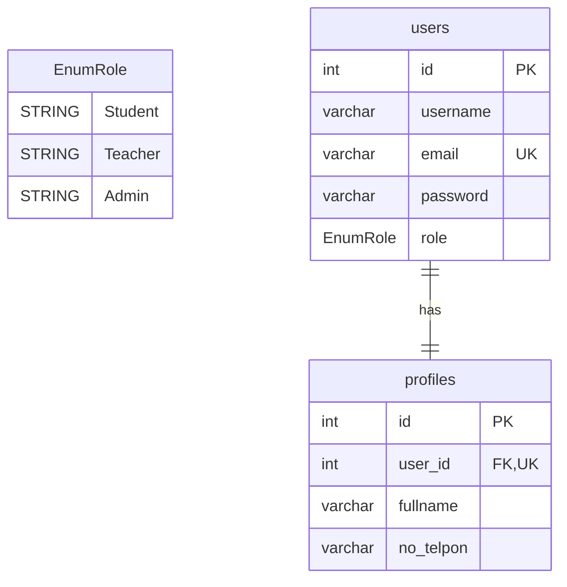

```mermaid

erDiagram
    EnumRole {
        STRING Student
        STRING Teacher
        STRING Admin
    }

    users {
        int id PK
        varchar username
        varchar email UK
        varchar password
        EnumRole role
    }

    profiles {
        int id PK
        int user_id FK,UK
        varchar fullname
        varchar no_telpon
    }

    users ||--|| profiles : "has"

```
