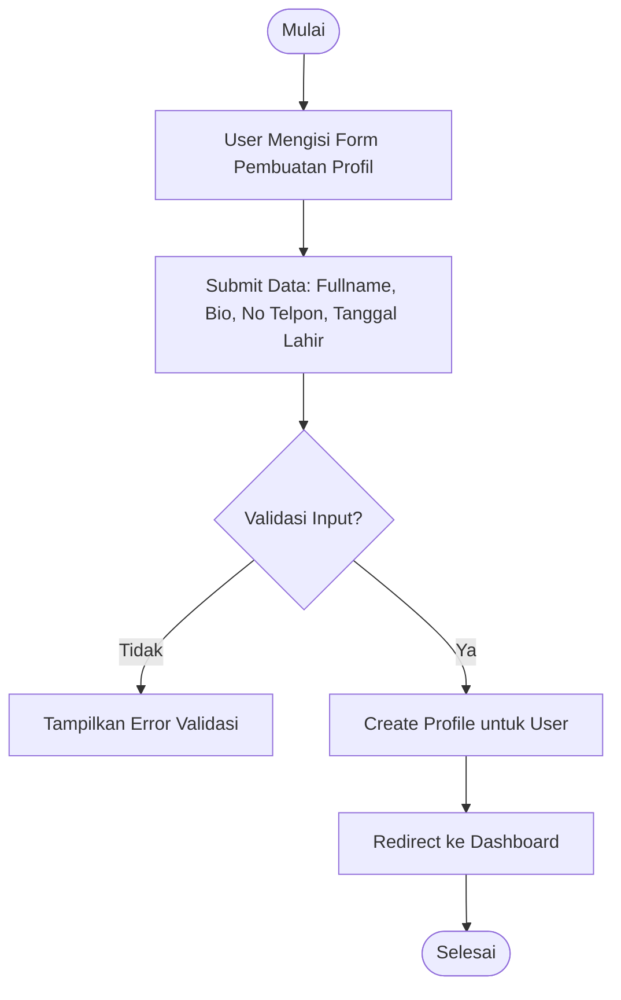

```mermaid

flowchart TD
    Start([Mulai]) --> Form[User Mengisi Form Pembuatan Profil]
    Form --> Submit[Submit Data: Fullname, Bio, No Telpon, Tanggal Lahir]
    Submit --> Val{Validasi Input?}
    Val -- Tidak --> ErrVal[Tampilkan Error Validasi]
    Val -- Ya --> CreateProfile[Create Profile untuk User]
    CreateProfile --> Redir[Redirect ke Dashboard]
    Redir --> End([Selesai])
```
