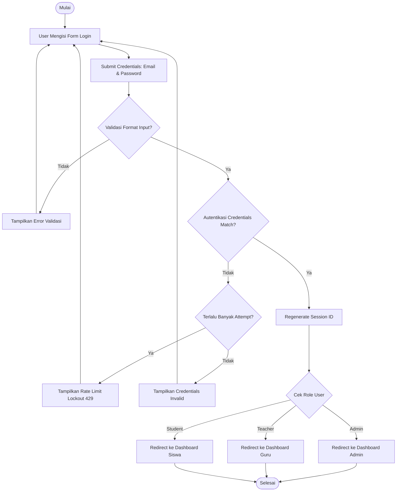

```mermaid

flowchart TD
    Start([Mulai]) --> Form[User Mengisi Form Login]
    Form --> Submit[Submit Credentials: Email & Password]
    Submit --> Val{Validasi Format Input?}
    
    Val -- Tidak --> ErrVal[Tampilkan Error Validasi]
    ErrVal --> Form
    
    Val -- Ya --> AuthCheck{Autentikasi Credentials Match?}
    AuthCheck -- Tidak --> Throttle{Terlalu Banyak Attempt?}
    
    Throttle -- Ya --> ErrRate[Tampilkan Rate Limit Lockout 429]
    Throttle -- Tidak --> ErrAuth[Tampilkan Credentials Invalid]
    ErrAuth --> Form
    ErrRate --> Form
    
    AuthCheck -- Ya --> RegSession[Regenerate Session ID]
    RegSession --> CheckRole{Cek Role User}
    
    CheckRole -- Admin --> RedirAdmin[Redirect ke Dashboard Admin]
    CheckRole -- Teacher --> RedirTeacher[Redirect ke Dashboard Guru]
    CheckRole -- Student --> RedirStudent[Redirect ke Dashboard Siswa]
    
    RedirAdmin --> End([Selesai])
    RedirTeacher --> End
    RedirStudent --> End

```
