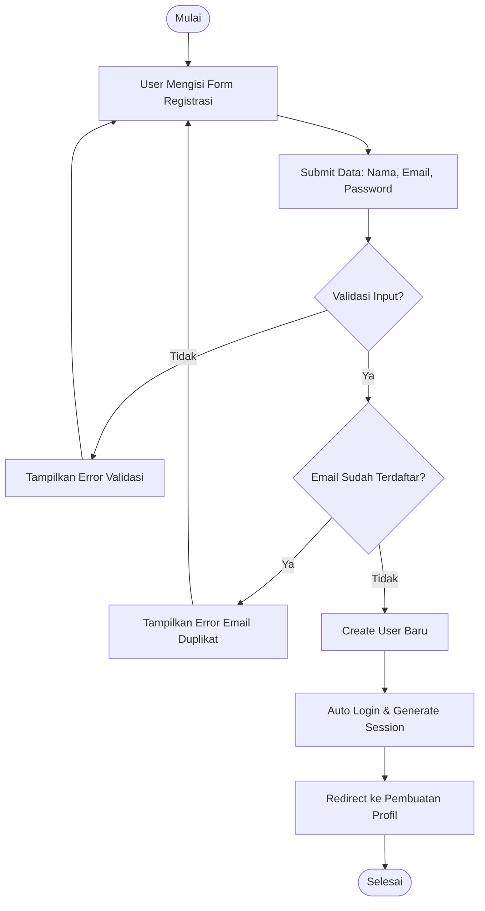

```mermaid

flowchart TD
    Start([Mulai]) --> Form[User Mengisi Form Registrasi]
    Form --> Submit[Submit Data: Nama, Email, Password]
    Submit --> Val{Validasi Input?}
    
    Val -- Tidak --> ErrVal[Tampilkan Error Validasi]
    ErrVal --> Form
    
    Val -- Ya --> CheckEmail{Email Sudah Terdaftar?}
    CheckEmail -- Ya --> ErrEmail[Tampilkan Error Email Duplikat]
    ErrEmail --> Form
    
    CheckEmail -- Tidak --> CreateUser[Create User Baru]
    CreateUser --> AuthLogin[Auto Login & Generate Session]
    AuthLogin --> Redir[Redirect ke Pembuatan Profil]
    Redir --> End([Selesai])

```
